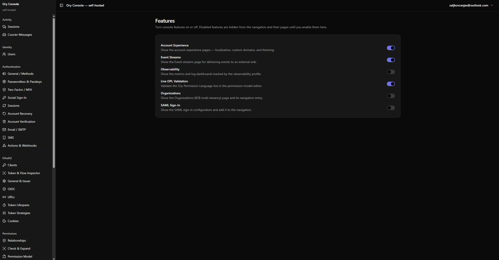

# Ory Self-Hosted Console (`ory-ui`)


> A fully open-source, single-tenant, drop-in replacement for the **Ory Network Console** — run the whole Ory stack and manage it from one admin UI, on your own infrastructure.



## ✨ Highlights

- **One command up.** `docker compose up` brings up Postgres + Ory Kratos, Hydra, Keto, Oathkeeper + a Rust backend + a Next.js console.
- **No gated features.** Everything the hosted Console locks behind an Enterprise license — SAML, Organizations, Account Experience, branding, metrics — is here as real open source.
- **Manage everything in the UI.** Identities, OAuth2 clients, permissions, SSO, and all service configuration — against **your own** Ory services.
- **Build it your way.** A guided `ory-console` CLI lets you choose which Ory services to run, bring your own externally-hosted ones, and toggle features.
- **Secure by design.** The browser only ever talks to the backend; Ory admin ports are never exposed to the host.

> [!NOTE]
> Designed for a team running **its own** Ory stack (single-tenant, operator-controlled) — not a multi-tenant SaaS.

## 🚀 Quickstart

**Prerequisites:** Docker + Docker Compose v2.

```bash
# 1. Create your .env from the template (or use the CLI builder, below)
cp .env.example .env        # then edit the secrets

# 2. Bring up the stack
docker compose up -d --wait

# 3. Grab the one-time setup token printed on first boot
docker compose logs backend | grep -i bootstrap

# 4. Open http://localhost:3000/setup, paste the token, create your admin
```

Then log in to the **admin console** at **http://localhost:3000**. The end-user **Account Experience** (sign-in, registration, recovery, settings) is served separately at **http://localhost:3001**.

> [!TIP]
> Prefer guided setup over editing `.env` by hand? Use the [`ory-console init` builder](#️-cli-builder).

## Features

**Identity & access**
- Users & identities CRUD, JSON-Schema identity-schema editor (Monaco), bulk import
- OAuth2 / OIDC clients (Hydra), token introspect/revoke, full Hydra config
- Permissions: relation-tuple CRUD, check/expand, and a live-validated Ory Permission Language editor
- Oathkeeper access-rules editor

**Authentication & SSO** — all OSS, no license

- Full Kratos auth config: methods, passwordless/passkeys, MFA, social OIDC, recovery, verification, sessions, SMTP, SMS
- SAML sign-in via an embedded Ory Polis (Apache-2.0) SAML→OIDC bridge
- Organizations — email-domain → SSO-connection mapping
- Account Experience — a self-hosted end-user login / recovery / settings app, with theming & localization editors

**Operations**
- Server-side feature toggles
- Optional observability (Prometheus + Grafana + Loki + Alloy)
- Event streams + a durable, HMAC-signed webhook dispatcher
- Project overview, members, API keys, audit log

## 🛠️ CLI builder

`ory-console init` is a guided builder: choose your services, point at your own Ory instances, and pick features. In host mode it also brings the stack up and health-checks it end-to-end.

```bash
ory-console init                                # interactive wizard
ory-console init --defaults                     # recommended defaults, no prompts
ory-console init --config console.config.toml   # re-apply a saved build
```

Don't have the binary installed? Run it straight from source in this repo (host mode, Docker required):

```bash
cargo run -p ory-console-cli -- init            # build + run the wizard from source
```

- **Selective services** — Kratos, Hydra, Keto, Oathkeeper, and Polis are each `in-stack | bring-your-own | off`. Turning one **off** also disables its console features server-side. Postgres, backend, and frontend are always required.
- **Bring-your-own** — point at an Ory service you already host; the wizard health-checks the connection and **blocks on failure** (`--skip-checks` to override).
- **Reproducible** — writes a `console.config.toml` you can commit and re-apply. Secrets stay in `.env`, never the config file.

<details>
<summary>Day-2 commands (run in-container)</summary>

These authenticate to the backend API and drive the same validated routes the UI uses:

```bash
docker compose run --rm cli feature enable saml
docker compose run --rm cli feature list
docker compose run --rm cli observability on
docker compose run --rm cli org add --label "Acme" --domain acme.com
docker compose run --rm cli oauth github set                  # prompts for the secret
docker compose run --rm cli admin create --via-setup --name "Admin" --email you@example.com
```

Secrets are always read from an env var / `--*-file` / prompt — never an argv flag.
</details>

## ⚙️ Configuration

- **Service config** (Kratos/Hydra/Keto/Oathkeeper/Polis) is edited **in the console** — it writes the mounted YAML, validates it, and restarts only the affected service.
- **Secrets** come from `.env` / secret files and are never logged or sent to the browser.
- Interoperates with the official `ory` CLI (identity schemas, OAuth2 clients, Keto tuples).

### Database migrations

Migrations run **automatically** — there's no manual step for the normal flow:

- On `docker compose up`, the `kratos-migrate` / `hydra-migrate` / `keto-migrate` one-shot containers apply each Ory service's schema *before* that service starts.
- The backend applies its own `console`-database migrations (`backend/migrations/`) at boot, before serving — idempotent, so re-running `up` is a no-op.

To start **completely fresh** (wipes all data and re-runs every migration from scratch):

```bash
docker compose down -v && docker compose up -d --wait
```

> [!NOTE]
> **Bring-your-own Postgres:** create the per-service databases and roles on your external instance first (`kratos`, `hydra`, `keto`, `console`, `polis`) — the migrate steps above then apply their schemas to it on the next `up`.

### Email & SMS

Recovery, verification, and one-time-code sign-in are wired end-to-end. For local development, an opt-in profile ships mail/SMS catchers so the flows work with no external accounts:

```bash
docker compose --profile dev-mail up -d --wait
```

Read captured email at **http://localhost:8025** (Mailpit) and SMS at **http://localhost:8026**.

> [!WARNING]
> The catchers are dev-only and never start with a plain `docker compose up`. **In production**, point Kratos at a real SMTP server and SMS gateway via the console's **Email/SMTP** and **SMS** pages. Until you do, recovery/verification mail queues but is not delivered.

### Optional observability

```bash
docker compose --profile observability up -d --wait
```

Then enable the **Observability** feature. Grafana is reachable only through the authenticated backend proxy — never published to the host.

## 🔒 Security

- Ory admin ports are **never published to the host** — only the backend reaches them, on an internal-only network.
- Service restarts go through a scoped socket-proxy broker; the backend holds **no** Docker socket.
- Console auth: Argon2id passwords, opaque DB-backed sessions behind a `__Host-` cookie, CSRF protection, rate limiting, a one-time bootstrap token, optional GitHub OAuth.
- Feature flags are enforced server-side; outbound webhooks are SSRF-guarded; SAML enforces IdP signing certs with an `email_verified`-gated mapper.

<details>
<summary>Documented residual risks (single-tenant, operator-controlled)</summary>

- Account Experience shares an internal network segment with Kratos, which co-listens its admin port; the AX has no admin credentials and the port is not host-published. Full isolation would need an L7 proxy in front of Kratos.
- The backend `/metrics` endpoint is unauthenticated (Prometheus pull model) and relies on its port not being host-published.
- Hydra runs with `--dev` — documented and acceptable for single-tenant self-hosting.
</details>

## Architecture

<details>
<summary>How it fits together</summary>

The browser talks **only** to the Rust/Salvo backend — the single API layer. The Ory admin APIs stay on an internal-only network with no host ports. Console state (accounts, sessions, feature flags, webhooks, audit log, API keys) lives in a dedicated `console` Postgres database.

```
                 ┌─────────────── edge network ───────────────┐
   browser ──────▶ frontend (Next.js admin console :3000)      │
                 │ account-experience (Ory Elements UI :3001)  │
                 └───────────────┬─────────────────────────────┘
                                 │ (the only Ory client)
                 ┌───────────────▼──── internal network (no host ports) ────────┐
                 │ backend (Rust/Salvo :8080) ── console Postgres DB             │
                 │   ├─ Kratos / Hydra / Keto / Oathkeeper (admin APIs)          │
                 │   ├─ Ory Polis (SAML→OIDC bridge)                             │
                 │   ├─ restart-broker (socket-proxy; sole Docker-socket holder) │
                 │   └─ [observability profile] Prometheus/Grafana/Loki/Alloy    │
                 └───────────────────────────────────────────────────────────────┘
```

All Ory images are pinned to `v26.2.0-distroless`, with the Rust client crates tracked in lockstep.
</details>

<details>
<summary>Development</summary>

- **Backend:** Rust (Cargo workspace: `console-core` shared DTOs + `backend` + `cli`), Salvo 0.93, sqlx 0.9 with committed offline metadata.
- **Frontend:** Next.js 16 + React 19 + TypeScript, TanStack Table/Query, React Hook Form + Zod, shadcn/ui, Monaco (vendored same-origin — zero CDN egress). npm only.
- **Verification:** each feature area ships a live acceptance harness under `scripts/verify/` that brings up the real stack and asserts behavior, including negative/security checks.
</details>

## Star History

[](https://www.star-history.com/?repos=zeljkovranjes%2Fory-self-hosted-console&type=date&legend=top-left)

## License

Licensed under **Apache-2.0** (declared in the crate manifests). No gated or license-restricted features.
